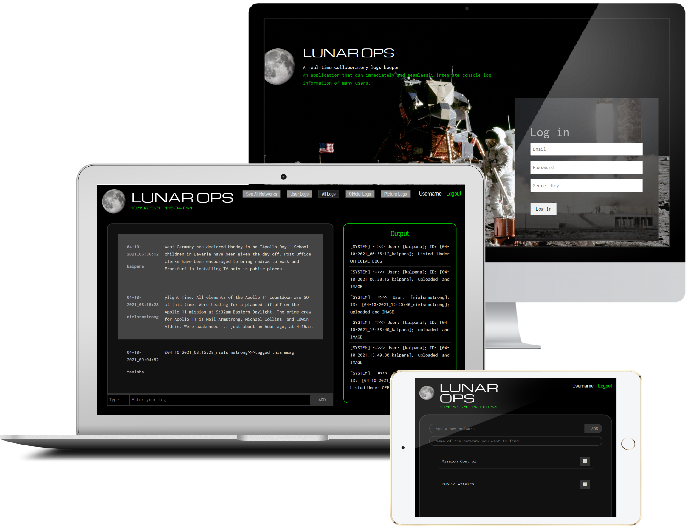

# Lunar Surface Operations: Real-Time Collaboration
As astronauts collect data on the Moon, NASA and the worldwide scientific community will be documenting and reviewing the information in real time.
- Video Link: https://vimeo.com/894586938?share=copy
- PPT Link: https://cutt.ly/vEJsHLn

## Current Implementation
- Each flight control team member creates and maintains a console log to record the information necessary to support his/her job duties. 
- This console log becomes part of the official record of the mission.
- There is no way for a flight controller to simultaneously see the live creation of logs by others or to synchronize multiple people's logs to compare notes with different authors during or after a mission.

## Objective
Application that can immediately and seamlessly integrate console log information of many users (at least 100+ users on the same network).

## Features
- Authentication
- Multiple simultaneous users within a network
  - [x] Creating their own console logs
  - [x] Editing their own console logs
  - [x] Logs visible to people in the same network
  - [x] Meta data: message|img|audio|video, date-time stamp, author, entry topic
  - [x] View inter-mixed logs of the network arranged by time, author, etc
  - [x] Enable no future edit option on their logs - official written record for that user's profile
  - [x] tagging other log enties in the network
  - [x] COMMANDS

## Team Mates
`Tanisha` [`Prakhar Kaushik`](https://github.com/PrakharKaushik213) [`Arnav S Roy`](https://github.com/VenomousAtom)
